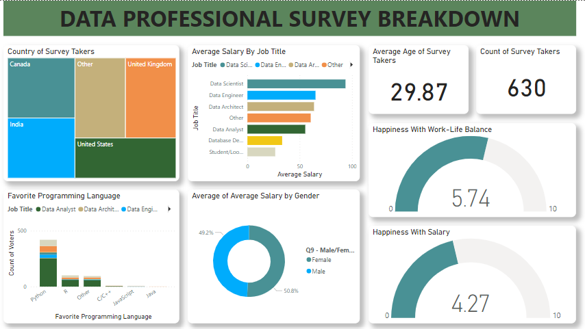

# Data Professional Survey

# Introduction 
The Data Professional Survey is a comprehensive exploration of the world of data professionals, seeking insights into their roles, preferences, challenges, and aspirations. It delves into diverse roles, tools, and technologies used, while also examining compensation, satisfaction, work-life balance, and emerging industry trends.

This survey serves as a vital resource for organizations, professionals, and educators, guiding them in understanding the evolving needs of data experts. It informs decisions related to training, career choices, and creating supportive work environments, ultimately contributing to the growth and development of the data field.

# Problem Statement
This dataset offers an opportunity to derive critical insights such as:
- Identifying the favored programming language, categorized by country.
- Determine the overall favorite programming language and its voter count.
- Analyze average salaries by gender and job title.
- Calculate the survey taker count and average age.
- Evaluate satisfaction levels regarding work-life balance and compensation.

# Data Collection and Cleaning
The dataset was gotten from https://github.com/AlexTheAnalyst/Power-BI/blob/main/Power%20BI%20-%20Final%20Project.xlsx

Data Preparation: The data was imported into Power BI directly from an Excel file and then transformed into a usable format using Power Query. 

This step involves:
- Eliminating null and duplicate columns.
- Splitted the columns using custom delimeters.
- Addressing Salary Data: A detailed process was undertaken to refine salary data, including duplicating the "Yearly Salary" column, splitting it into numerical and non-numerical segments, and eliminating extraneous characters like 'k,' '-', and '+.' Additionally, a new column was created to calculate the average salary, providing a comprehensive perspective on earnings.
  
     After the transformation process, the changes were applied, concluding the data preparation phase. The dataset was then loaded for in-depth analysis and visualization within Power BI.

# Dashboard

# Insights
- Among data professionals, Python emerges as the most favored programming language. The survey analyzes preferences for Python, R, and C++ giving us a better understanding of the technology they prefer in their work.
- Data Scientists earn the highest salaries, followed by Data Engineers and Data Architects. Gender-wise, there's nearly an equal split between female and male respondents.
- Professionals express moderate salary satisfaction but generally report a favorable work-life balance.

# Conclusion

The survey results provide valuable insights into the data field, highlighting the importance of Python as a preferred programming language, the earning potential of various data roles, and the significance of work-life balance. Organizations and professionals can utilize these findings to make informed decisions and drive positive changes in the industry.
